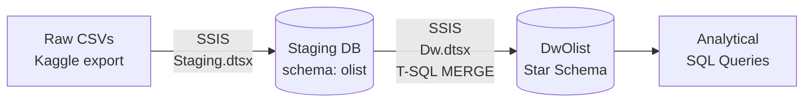
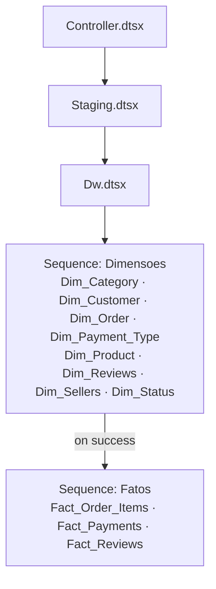

# Olist Brazilian E-commerce — SQL Server ETL & Data Warehouse

An end-to-end **data engineering** project: raw CSV exports from a real Brazilian e-commerce marketplace are ingested into a **SQL Server staging layer** with **SSIS**, then transformed into a **Kimball star schema** (`DwOlist`) with three fact tables that share dimensions.

> **Scope:** this repository covers the data engineering layer only (ingestion → staging → dimensional model → analytical SQL). There is no semantic model or BI layer.

---

## Table of Contents

- [Business Context](#business-context)
- [Architecture](#architecture)
- [Tech Stack](#tech-stack)
- [Repository Structure](#repository-structure)
- [Data Source](#data-source)
- [Staging Layer](#staging-layer)
- [Dimensional Model](#dimensional-model)
- [ETL Pipeline (SSIS)](#etl-pipeline-ssis)
- [Data Quality Challenge: the Reviews CSV](#data-quality-challenge-the-reviews-csv)
- [Transformation Rules](#transformation-rules)
- [Analytical Queries](#analytical-queries)
- [How to Run](#how-to-run)
- [Known Limitations & Next Steps](#known-limitations--next-steps)

---

## Business Context

[Olist](https://olist.com/) is a Brazilian marketplace that connects small merchants to large sales channels. Its operational data (orders, items, payments, reviews, customers, sellers, products) is spread across separate files with no analytical structure.

This project turns that data into a dimensional model that answers questions like:

- Which product categories have the best customer reviews?
- What is the average delivery time per state, and how often are orders late?
- Which payment methods are the most used, and how many installments do customers choose?

---

## Architecture



| Layer | Database | Purpose |
|---|---|---|
| Source | CSV files | Raw Olist export (Kaggle) |
| Staging | `Staging` (schema `olist`) | 1:1 copy of the source files, truncated and reloaded on every run |
| Warehouse | `DwOlist` (schema `dbo`) | Star schema with surrogate keys, incremental loads via `MERGE` |

---

## Tech Stack

- **SQL Server 2022+** — the MERGE scripts use `IS DISTINCT FROM`, which requires SQL Server 2022
- **SSIS** (SQL Server Integration Services) — Visual Studio with the *SQL Server Integration Services Projects* extension
- **T-SQL** — `MERGE`-based dimension and fact loads
- **Python / pandas** — one-off cleanup of the malformed reviews CSV
- **dbdiagram.io** — schema diagrams (exported as SVG)

---

## Repository Structure

```
Olist ETL/
├── Datasets/                                        # Source CSVs (not versioned, see Data Source)
├── Merges/                                          # T-SQL MERGE scripts, one per DW table
│   ├── Dim_Category.sql
│   ├── Dim_Customer.sql
│   ├── Dim_Order.sql
│   ├── Dim_PaymentType.sql
│   ├── Dim_Product.sql
│   ├── Dim_Review.sql
│   ├── Dim_Sellers.sql
│   ├── Dim_Status.sql
│   ├── Fact_Order_Items.sql
│   ├── Fact_Payments.sql
│   └── Fact_Reviews.sql
├── OlistBrazilEcommerce.SSIS/                       # SSIS solution
│   └── OlistBrazilEcommerce.SSIS/
│       ├── Controller.dtsx                          # Master package: Staging -> Dw
│       ├── Staging.dtsx                             # CSV -> Staging
│       ├── Dw.dtsx                                  # Orchestrates dimensions -> facts
│       ├── Dim_*.dtsx                               # One package per dimension
│       ├── Fact_*.dtsx                              # One package per fact
│       └── *.conmgr                                 # Project-level connection managers
├── Olist Ecommerce Brasil - OLTP (Staging) DDL.sql  # Staging tables
├── Olist Ecommerce Brasil - star schema DDL .sql    # Warehouse tables + foreign keys
├── Olist Ecommerce Brasil - OLTP.svg                # Staging diagram
├── Olit Ecommerce Brasil - Star Schema.svg          # Star schema diagram
├── Analytical Queries.sql                           # Business questions answered from the DW
└── README.md
```

---

## Data Source

**[Brazilian E-Commerce Public Dataset by Olist](https://www.kaggle.com/datasets/olistbr/brazilian-ecommerce)** (Kaggle) — about 100k orders placed between 2016 and 2018.

| File | Description |
|---|---|
| `olist_orders_dataset.csv` | Orders and their lifecycle timestamps |
| `olist_order_items_dataset.csv` | Items in each order (price, freight, seller) |
| `olist_order_payments_dataset.csv` | Payments per order (type, installments, value) |
| `olist_order_reviews_dataset.csv` | Customer reviews (score, comment) — *see the data quality section* |
| `olist_customers_dataset.csv` | Customers and their location |
| `olist_sellers_dataset.csv` | Sellers and their location |
| `olist_products_dataset.csv` | Product attributes and category |
| `olist_geolocation_dataset.csv` | Zip code → lat/lng (staged, not used in the DW) |
| `product_category_name_translation.csv` | Portuguese → English category names |

The CSVs are not committed. Download them from Kaggle and place them in `Datasets/`.

---

## Staging Layer

- Lives in the `Staging` database, under the dedicated `olist` schema.
- The tables mirror the source files one-to-one. Dates and numeric product attributes are kept as `varchar` here, so a malformed value never breaks ingestion; types are enforced later, in the warehouse load.
- SSIS connects with a dedicated ETL login, **`usr.ETL`**, which only has schema-level permissions (least privilege), not `sysadmin`.
- Load pattern: **truncate and reload**. Each table has an `Execute SQL Task` (`TRUNCATE TABLE olist.<table>`) followed by a Data Flow from its flat file.

---

## Dimensional Model


The model follows the **Kimball bus architecture**: three fact tables at different grains, all sharing the conformed `Dim_Order` dimension.

### Fact tables

| Fact | Grain | Measures | Dimensions |
|---|---|---|---|
| `Fact_Order_Items` | One row per **item in an order** (`sk_order`, `order_item_id`) | `price`, `freight_value`, product weight/dimensions, shipping limit date | Order, Status, Customer, Product, Category, Seller |
| `Fact_Payments` | One row per **payment transaction** (`sk_order`, `payment_sequential`) | `payment_value`, `payment_installments` | Order, Payment Type |
| `Fact_Reviews` | One row per **review** | `review_score` | Order, Reviews |

### Dimension tables

| Dimension | Business key | Notes |
|---|---|---|
| `Dim_Order` | `order_id` | Lifecycle dates: purchase, approval, carrier, delivery, estimated delivery |
| `Dim_Status` | `order_status` | delivered, shipped, canceled, ... |
| `Dim_Customer` | `customer_id` | City, state, zip prefix. History is tracked with an `is_current` flag |
| `Dim_Product` | `product_id` | Name/description length, number of photos |
| `Dim_Category` | `product_category_name` | Missing categories are mapped to an "Unknown" member |
| `Dim_Sellers` | `seller_id` | City, state |
| `Dim_Payment_Type` | `payment_type` | credit_card, boleto, voucher, debit_card |
| `Dim_Reviews` | `review_id` | Comment title/message, creation and answer dates |

Every dimension uses an `identity` **surrogate key** (`sk_*`) and keeps the source key as a **business key** (`bk_*`) for lookups during the load.

---

## ETL Pipeline (SSIS)



1. **`Controller.dtsx`** is the single entry point. It runs `Staging.dtsx` and, on success, `Dw.dtsx`.
2. **`Staging.dtsx`** truncates and reloads every staging table from its CSV.
3. **`Dw.dtsx`** has two sequence containers:
   - **Dimensoes** runs every dimension package. They don't depend on each other, so they run in parallel.
   - **Fatos** runs only after all dimensions succeed, so every surrogate key lookup has a target.
4. Each `Dim_*` / `Fact_*` package runs the matching T-SQL script in `Merges/`.

### Why `MERGE`?

The warehouse loads are **idempotent and incremental**: re-running the pipeline inserts new rows, updates rows that changed, and leaves everything else alone. Change detection uses `IS DISTINCT FROM`, which treats `NULL` correctly (unlike `<>`), so updates only fire when a value actually changed.

Facts look up surrogate keys by joining staging rows to each dimension on its business key.

---

## Data Quality Challenge: the Reviews CSV

The reviews file was the hardest part of ingestion, and the SSIS load of `olist_order_reviews_dataset.csv` kept failing.

**Root cause (two problems at once):**
1. **Commas inside free-text fields without a consistent text qualifier.** Comments like `"chegou rápido, recomendo"` were split into extra columns, so rows no longer matched the expected layout.
2. **Emojis in customer comments.** They can't be represented in code page **1252** (the flat file source's encoding), which caused conversion errors.

**Fix:**
1. Re-exported the file with **Python/pandas** using `quoting=csv.QUOTE_MINIMAL`, so every field containing a comma is properly quoted.
2. Stripped emojis and other characters outside the target code page.
3. Saved the result as `olist_order_reviews_dataset_fixed.csv`, and set the **Text Qualifier** to `"` on the SSIS flat file connection manager.

After the fix, all reviews load cleanly into staging.

---

## Transformation Rules

| Rule | Where | Why |
|---|---|---|
| Text dates converted with `TRY_CONVERT(..., 101)` | `Dim_Order` | Malformed values become `NULL` instead of failing the load |
| Missing dates replaced with `1900-01-01` | `Dim_Order`, `Dim_Reviews` | Avoids `NULL`s in date columns; **analytical queries must filter this placeholder out** |
| Empty/`NULL` category → "Unknown" | `Dim_Category` | Keeps an explicit member for uncategorized products |
| Text numbers converted with `TRY_CONVERT(int, NULLIF(x, ''))`, defaulting to `0` | `Dim_Product` | Source stores numeric attributes as text, sometimes empty |
| Missing review title/message → `'Not Provided'` | `Dim_Reviews` | Distinguishes "no comment" from a load error |
| Changed customer rows flagged `is_current = 0` and re-inserted | `Dim_Customer` | Keeps customer location history |

---

## Analytical Queries

`Analytical Queries.sql` answers three business questions from the warehouse:

| # | Question | Technique |
|---|---|---|
| 1 | Which product categories have the best average review score? | Deduplicates (order, category) pairs first, because reviews are per order, not per item; `DENSE_RANK`; minimum sample of 100 reviews |
| 2 | What is the average delivery time by customer state, and how many orders arrive late? | `DATEDIFF` on order lifecycle dates; filters delivered orders and placeholder dates |
| 3 | Which payment methods are the most used? | Window aggregates (`SUM(COUNT(*)) OVER ()`) to compute the % share of transactions and value |

---

## How to Run

### Prerequisites

- SQL Server 2022+ (Developer edition is fine)
- Visual Studio with the **SQL Server Integration Services Projects** extension
- Microsoft OLE DB Driver 19 for SQL Server (`MSOLEDBSQL19`)

### Steps

1. **Get the data.** Download the dataset from Kaggle and extract it into `Datasets/`. Produce `olist_order_reviews_dataset_fixed.csv` as described in the [data quality section](#data-quality-challenge-the-reviews-csv).
2. **Create the databases.**
   ```sql
   CREATE DATABASE Staging;
   GO
   CREATE DATABASE DwOlist;
   GO
   USE Staging;
   GO
   CREATE SCHEMA olist;
   GO
   ```
3. **Create the tables.**
   - Run `Olist Ecommerce Brasil - OLTP (Staging) DDL.sql` against `Staging`.
   - Run `Olist Ecommerce Brasil - star schema DDL .sql` against `DwOlist`.
4. **Create the ETL login.** Create `usr.ETL` with read/write permissions on the `olist` schema in `Staging` and on `dbo` in `DwOlist`. Alternatively, switch the connection manager to Windows Authentication.
5. **Point the connections to your machine.** The flat file connection managers (`*.conmgr`) use absolute paths. Update them to your `Datasets/` folder, and update `localhost.Staging.usr.ETL` to your SQL Server instance.
6. **Run it.** Open `OlistBrazilEcommerce.SSIS.slnx` in Visual Studio and execute **`Controller.dtsx`**.
7. **Query it.** Run `Analytical Queries.sql` against `DwOlist`.

---

## Known Limitations & Next Steps

- [ ] **`Fact_Reviews.sk_order` isn't populated.** The MERGE inserts only `sk_review` and `review_score`. Add `sk_order` so reviews can be joined to orders and categories.
- [ ] **Uncategorized products are dropped from `Fact_Order_Items`.** The category lookup joins on the raw (`NULL`/empty) value, while the dimension stores "Unknown". Apply the same `ISNULL(NULLIF(...))` rule in the fact lookup.
- [ ] **`Dim_Customer` history logic** re-inserts customers with an inactive version on every run, and doesn't track `valid_from`/`valid_to`. Upgrade it to a full SCD Type 2.
- [ ] **The DDL file is out of sync** with the deployed schema (e.g. `bk_status` vs `order_status`, `freight_value int` vs `decimal`, `Shopping_limit_date`). Regenerate it from the database.
- [ ] **Product physical attributes** (weight, dimensions) live in `Fact_Order_Items`. They belong in `Dim_Product`.
- [ ] **Add a `Dim_Date`** for calendar analysis (year, month, weekday) instead of raw date columns.
- [ ] **Use the geolocation file.** It's staged but unused. Olist has several lat/lng rows per zip prefix, so it needs aggregating before it can enrich `Dim_Customer` and `Dim_Sellers`.
- [ ] **Parameterize connections** with SSIS project parameters/environments instead of hard-coded paths.
- [ ] **Automate the reviews CSV cleanup** as a versioned Python script (or a Script Component) instead of a one-off step.
- [ ] **Add logging and row-count reconciliation** (staging vs DW) to the pipeline.

---

## Author

**Neto** — Data Scientist working with the Microsoft BI stack (SQL Server, SSIS, SSAS, Power BI), moving toward data engineering.
